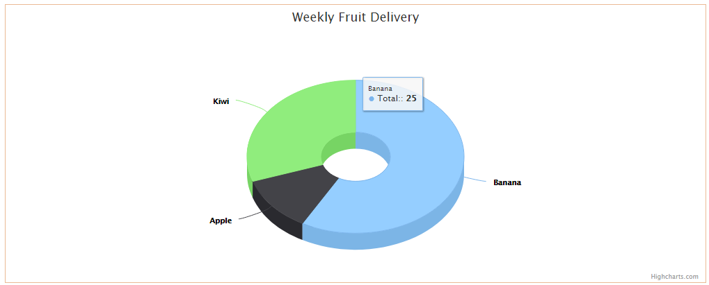
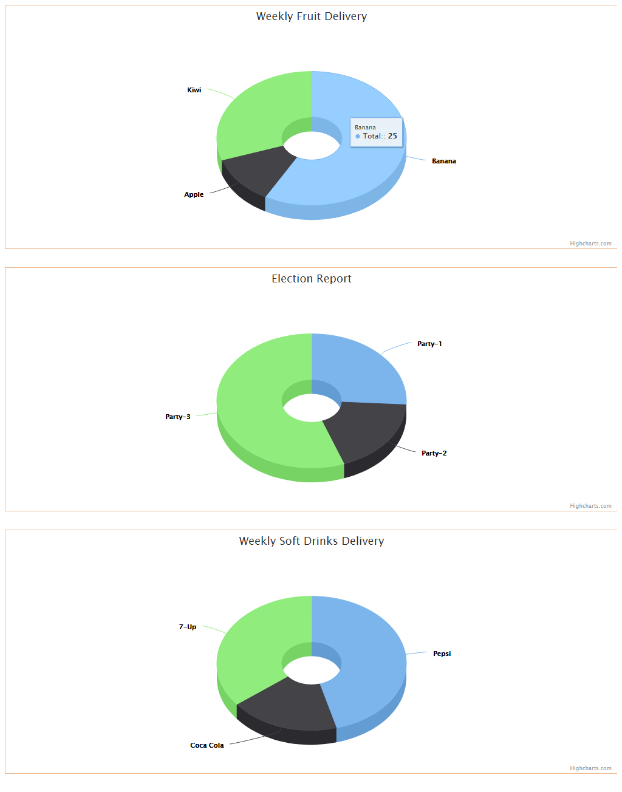

# Multiple Donut Chart Component - Angular 1.6.1

## Implementation

This Donut Chart Component has been built in Angular 1.6.1.

Higchart API has been used to render the chart. 

## Single Chart

## Mutltiple Charts

